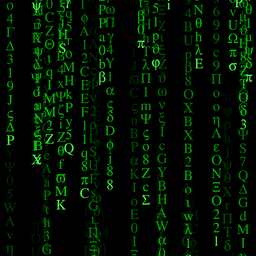

# COSC 594 - Lab 1

Matrix rain with jgraph

## About

This program uses jgraph to render a video of the so-called ["Matrix rain"](https://en.wikipedia.org/wiki/Matrix_digital_rain) effect, featured prominently in *The Matrix* film franchise.



## Instructions

First off, aside from all of the standard shell utilities, you'll need to have the following programs:

* [`convert`](https://imagemagick.org/)
* [`ffmpeg`](https://ffmpeg.org/)
* [`jgraph`](http://web.eecs.utk.edu/~jplank/plank/jgraph/jgraph.html)
* [`lua`](https://www.lua.org/)
* [`ps2pdf`](https://www.ghostscript.com/)

The Hydra machines have `convert`, `lua`, and `ps2pdf` installed, and Dr. Plank has a `jgraph` executable in his home directory. A static `ffmpeg` binary for Linux/amd64 is included in this git repository.

To run, just type the following into a terminal:

```
$ ./matrixrain.sh <videofile> <time>
```

where `<videofile>` is what you want the output video file to be named, and `<time>` is the length of the video in seconds. Most of the options for customizing the video are controlled by variables inside the script. Open it with your editor of choice and play around with these values.

To generate the examples, type the following into a terminal:

```
$ make examples
```

Note that this will take a **very long time** to finish; the performance of this program is bottlenecked by the need to run `convert` for each frame of the video. To that end, I have pre-rendered all of the included examples and uploaded them to YouTube. Click on the links below to see them:

* ["default"](https://youtu.be/AHWzZB32yI0)
* ["tiny"](https://youtu.be/G6tmnxP6Zyw)
* ["chaotic"](https://youtu.be/SmaRYUANee4)
* ["snowy"](https://youtu.be/PiRidffYSFE)
* ["dailup"](https://youtu.be/WEAIcGjXG1U)
* ["myeyesarebleeding"](https://youtu.be/XoQjTu242zc) (Don't say I didn't warn you)
